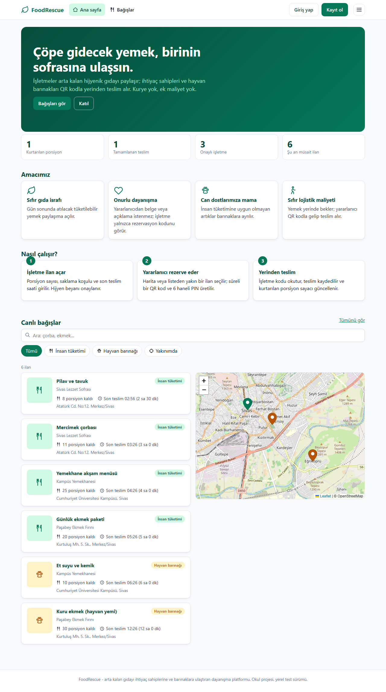
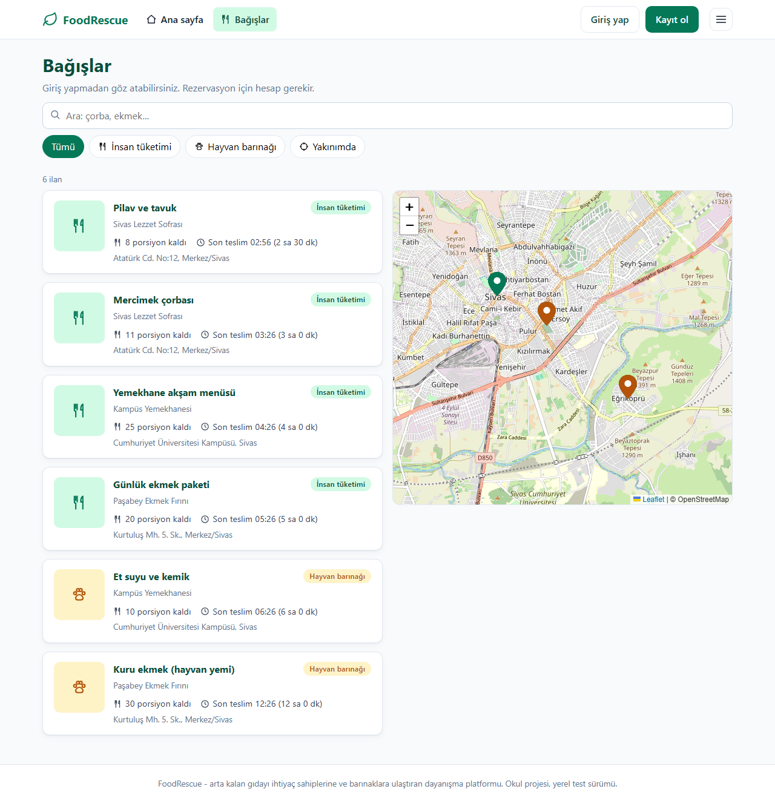
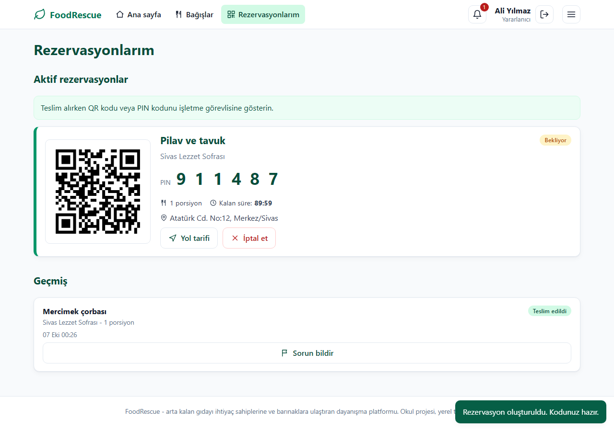
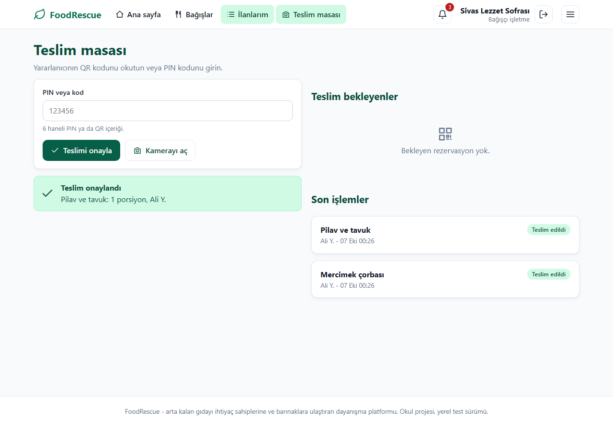
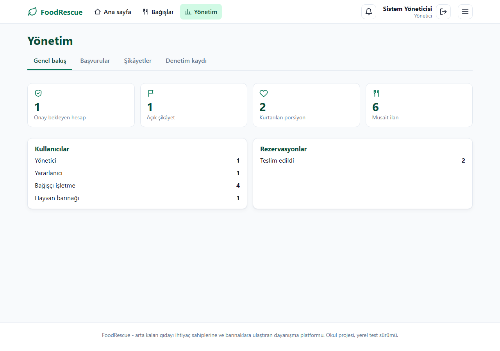
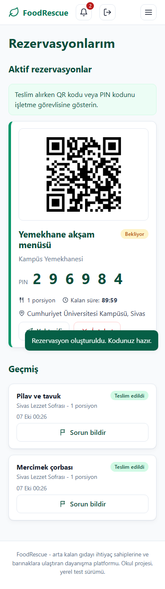

# FoodRescue

Restoran, fırın ve yemekhanelerin arta kalan hijyenik gıdasını; ihtiyaç sahiplerine (askıda yemek) ve hayvan barınaklarına, **kuryesiz** ve **QR kodla yerinden teslim** modeliyle ulaştıran dayanışma platformu.

> **Örnek okul proje ödevi.** Bu depo, bilgisayar mühendisliği öğrencilerinin **programlama dilleri** ve **veritabanına giriş** derslerinde bir dönem projesini nasıl kurabileceğine dair eksiksiz, çalışan bir örnektir. Python (FastAPI), JavaScript (framework'süz ES modülleri) ve SQL'i tek bir gerçek uygulamada birleştirir. 5 kişilik ekip için 5 modüle bölünmüştür; her modülde ders notları, çalıştırılabilir SQL çalışma defteri ve alıştırmalar vardır. Kopyalayıp kendi ödeviniz için başlangıç noktası yapabilir, ama kodu okuyup anlamadan teslim etmemenizi öneririz: asıl değer okuma planında ve alıştırmalardadır.

## Ekran görüntüleri

| Ana sayfa | Bağış akışı ve harita | QR + PIN cüzdanı |
| --- | --- | --- |
|  |  |  |

| Teslim masası (bağışçı) | Yönetici paneli | Mobil |
| --- | --- | --- |
|  |  |  |

Tüm ekranlar (42 görüntü, her rol, masaüstü ve mobil): [`screenshots/`](screenshots/). Yenilemek için `python tools/screenshots.py`.

> Proje adı henüz kesinleşmedi. "FoodRescue" çalışma adıdır; tek bir yerden (`app/config/settings.py`, `web/config/strings.js`) değiştirilir.

## Hızlı başlangıç (yerel test sunucusu)

```bash
python -m pip install -r requirements.txt
python run.py            # http://127.0.0.1:8000  (ilk açılışta demo veri yüklenir)
python run.py --reset    # veritabanını sıfırla
python run.py --port 8010
```
Windows'ta çift tıklayarak: `start.bat`. API belgeleri: `http://127.0.0.1:8000/docs`

Demo hesapları (hepsinin parolası `Demo12345`, yalnızca yerel test içindir):

| Rol | E-posta | Ne denenir |
| --- | --- | --- |
| Yönetici | `admin@foodrescue.local` | Başvuru onayı, şikâyetler, denetim kaydı |
| Bağışçı (onaylı) | `restoran@foodrescue.local` | İlan açma, teslim masası (QR/PIN) |
| Bağışçı (onay bekleyen) | `yeni.isletme@foodrescue.local` | Onaylanmadan ilan açılamadığını görme |
| Yararlanıcı | `ogrenci@foodrescue.local` | Rezervasyon, QR/PIN cüzdanı, şikâyet |
| Barınak | `barinak@foodrescue.local` | Hayvan yemi ilanlarını rezerve etme |

Harita ve kamera ile QR okuma için tarayıcının internet erişimi gerekir (Leaflet ve html5-qrcode CDN'den yüklenir). Erişim yoksa liste ve elle PIN girişi çalışmaya devam eder.

## Başkalarıyla paylaşıp test ettirmek (Cloudflare geçici link)
```bash
python tools/share.py        # veya share.bat
```
Sunucuyu başlatır, `https://<rastgele>.trycloudflare.com` adresi açar, linki ve **o oturuma özel rastgele yönetici parolasını** yazdırır (`data/share_info.txt`, git dışında). Ctrl+C ile kapatınca link ölür. Gereken: `cloudflared`. Bu komut yerel sunucunuzu internete açar: gerçek kişisel veri girilmesini istemeyin, bitince kapatın. Test hesaplarının (yönetici hariç) parolası `Demo12345` olduğundan paylaşılan örnekte yalnızca demo veri bulunmalıdır.

## Testler

```bash
python -m pytest tests -q --ignore=tests/e2e        # 41+ birim/API testi, saniyeler sürer
python -m pytest tests/e2e -q                       # tarayıcı testleri (pip install playwright && playwright install chromium)
SCREENSHOT_DIR=shots python -m pytest tests/e2e -q  # ekran görüntüleriyle
```

## SQL denemek için
```bash
python tools/sqlshell.py app/modules/impact/sql/queries.sql
python tools/sqlshell.py "SELECT role, COUNT(*) FROM users GROUP BY role"
```

## Yapı: 5 modül

| # | Modül | Sorumluluk | Ders bağlantısı |
| --- | --- | --- | --- |
| 1 | [identity](app/modules/identity/README.md) | Kayıt, giriş, roller, hesap onayı | Güvenlik, JWT, RBAC |
| 2 | [inventory](app/modules/inventory/README.md) | İlanlar, porsiyon stoğu, yakınlık, fotoğraf | Veritabanı kısıtları, atomik güncelleme |
| 3 | [reservation](app/modules/reservation/README.md) | Rezervasyon, QR/PIN, teslim doğrulama | Durum makinesi, sahiplik kontrolü |
| 4 | [notification](app/modules/notification/README.md) | Bildirimler, e-posta soyutlaması | Olay tabanlı tasarım, Open/Closed |
| 5 | [impact](app/modules/impact/README.md) | İstatistik, şikâyet, denetim kaydı, yönetim | SQL toplama, audit log |

```
app/
  config/        settings.py (ayarlar), messages.py (sunucu metinleri), events.py (olay adları)
  core/          modüllerin ortak altyapısı: db, güvenlik, olay yolu, hız sınırı, hata, harita matematiği
  modules/<ad>/  models.py  schemas.py  service.py  router.py  subscribers.py  module.py  sql/  README.md
  main.py        uygulama fabrikası (create_app)
  seed.py        demo veri
web/
  config/        app.js (ayarlar), strings.js (tüm arayüz metinleri)
  core/          dom, api, router, oturum, harita, arayüz yardımcıları
  modules/<ad>/  modülün sayfaları (index.js dışarıya açılan yüzeydir)
tests/           modül testleri + e2e/ (tarayıcı)
tools/           sqlshell.py
docs/            ARCHITECTURE.md, EKIP.md, ogrenme/
```

## Okuma sırası (öğrenciler için)
[docs/ogrenme/OGRENME_YOLU.md](docs/ogrenme/OGRENME_YOLU.md) dosyasından başlayın: hangi dersle hangi dosyanın eşleştiği, 4 haftalık okuma planı ve sözlük orada.

## Önemli tasarım kuralları
1. Modüller birbirinin `service.py` dosyasını **çağırmaz**; olay yayınlar. İstisnalar [ARCHITECTURE.md](docs/ARCHITECTURE.md) içinde listelidir.
2. Kodda gömülü metin yok: sunucu metinleri `app/config/messages.py`, arayüz metinleri `web/config/strings.js` içindedir.
3. Arayüzde `innerHTML` kullanılmaz (XSS'e karşı). Elemanlar `h()` ile kurulur.
4. Her iş kuralı değişikliği önce başarısız bir test, sonra çözüm ile yapılır.
5. Emoji yok; ikonlar SVG'dir.
6. **Kod yorumları Türkçe ve öğreticidir** (ne yaptığını değil NEDEN öyle yapıldığını anlatır). Bu, genel kodlama alışkanlığındaki 'yorumlar İngilizce' kuralından bilerek ayrılır, çünkü proje öğrenciler için yazılmıştır. Davranışı değiştirmeden yorum eklemek/güncellemek güvenlidir; yeni kod yazarken aynı yoğunlukta 'neden' yorumu bırakın.
