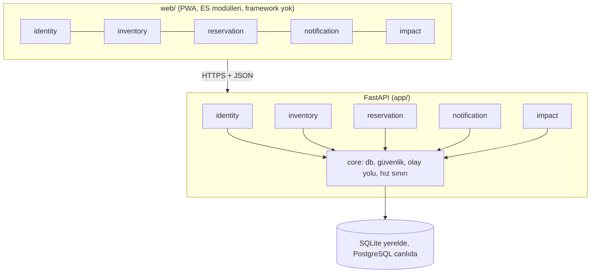

# Mimari

## Genel resim: modüler monolit

Tek süreç, tek veritabanı, ama **net modül sınırları**. 5 kişilik ekip için mikroservis fazla, tek dosyalık düz yapı yetersizdir.



## Katmanlar (her modülde aynı)

| Katman | Dosya | Bilmesi gereken | Bilmemesi gereken |
| --- | --- | --- | --- |
| Router | `router.py` | HTTP, durum kodları, şemalar | İş kuralı |
| Service | `service.py` | İş kuralları, işlem (transaction) sınırı | HTTP |
| Model | `models.py` | Tablolar, kısıtlar, indeksler | İş kuralı |
| Şema | `schemas.py` | Girdi doğrulama, dışarı verilen alanlar | Veritabanı |

**İşlem sınırı:** her `service` fonksiyonu (kullanım senaryosu) sonunda **bir kez** `commit` eder; hata olursa hiçbir şey kaydedilmez. Olay işleyicileri `commit` etmez, yayıncının işlemi içinde çalışır.

## Modüller arası bağımlılık

```
identity   <-  inventory  <-  reservation
    ^                              |
    |                              v
    +-------------  impact (okur; eşik aşılırsa identity'yi çağırır)
notification: yalnızca olayları dinler (User tablosuna salt okunur bakar)
```

Kurallar:
1. Aşağı yöndeki bağımlılıklar serbesttir (örn. reservation, `inventory.service.take_portions` çağırır; çünkü stok **tek bir sahibe** aittir).
2. **Yukarı** yönde veya yanlara çağrı yoktur; bunun yerine **olay** yayınlanır (`app/config/events.py`).
3. Başka modülün tablosuna **yazılmaz**. `impact` diğer tabloları yalnızca okur.
4. `notification` hiçbir modülün servisini çağırmaz.

## Olay akışı örneği: işletme askıya alınır

```
impact.file_complaint      3. farklı şikâyet  ->  identity.suspend_account
identity                   publish(account.suspended)
  inventory (dinler)       işletmenin müsait ilanlarını CANCELLED yapar, her biri için publish(food.cancelled)
    reservation (dinler)   o ilanların PENDING rezervasyonlarını CANCELLED yapar, publish(reservation.cancelled)
      notification         yararlanıcıya "ilan kaldırıldı", işletmeye "askıya alındınız" bildirimi
      impact (hepsini)     tüm bu olayları audit_log'a yazar
```
Hepsi **tek veritabanı işleminde** olur: ortada bir hata çıkarsa hiçbiri kaydedilmez.

## Zamanlı işler
`app/main.py` içindeki bakım döngüsü her 30 saniyede modüllerin `on_tick` fonksiyonlarını çağırır: `inventory.expire_due` (süresi biten ilanlar), `reservation.expire_due` (süresi biten rezervasyonlar, porsiyonlar stoğa döner). Test ederken döngü kapatılır ve fonksiyon doğrudan, sahte bir saatle çağrılır.

## Veri
Tablolar: `users`, `food_items`, `reservations`, `notifications`, `complaints`, `audit_log`. Tablolar uygulama açılırken `create_all` ile kurulur.
**Bilinen sınır:** `create_all` mevcut bir tablonun şemasını **değiştirmez**. Şema değişince yerel veritabanını `python run.py --reset` ile sıfırlayın. Üretimde Alembic migration kullanılmalıdır (bkz. aşağıdaki "Üretime geçerken").

## Teknoloji kararları

| Karar | Seçim | Gerekçe | Bedeli |
| --- | --- | --- | --- |
| Backend | FastAPI + Pydantic | Otomatik doğrulama ve `/docs`, Python öğrenimine uygun | Async/sync ayrımını bilmek gerekir (burada senkron) |
| ORM | SQLAlchemy 2 | Standart, SQL'e yakın | Öğrenme eğrisi: ORM ve ham SQL'i birlikte okuyun (`sql/` klasörleri) |
| Veritabanı | SQLite (yerel), PostgreSQL (üretim) | Kurulumsuz başlangıç | Eşzamanlı yazmada sınırlı |
| Kimlik | JWT (HS256) + scrypt | Durumsuz API | Token iptali zor (kısa ömür + yenileme önerilir) |
| Ön yüz | Vanilla JS, ES modülleri, build adımı yok | JS dilini öğretir, anlaşılır | Büyüdükçe bileşen modeli gerekir |
| Harita | Leaflet + OpenStreetMap (CDN) | Ücretsiz, anahtarsız | İnternet gerekir |
| QR | `qrcode` (SVG, sunucuda), `html5-qrcode` (okuma) | Küçük bağımlılık | Kamera izni gerekir |
| Olaylar | Süreç içi, senkron olay yolu | Modülleri ayırır, basit | Çok süreçli çalışmaya geçince kuyruğa (Redis vb.) evrilmeli |

## Güvenlik özeti
- Parola: scrypt + rastgele salt. Giriş: hatalı deneme sınırı, kullanıcı varlığını sızdırmayan yanıt.
- Yetki: her uç noktada rol + hesap durumu; teslim doğrulamada sahiplik sorgu düzeyinde.
- Teslim kodları: `secrets`; PIN denemesi işletme başına sınırlı.
- Yükleme: magic byte kontrolü, boyut sınırı, rastgele dosya adı.
- Ön yüz: `innerHTML` yok; token `localStorage`'da (ödünleşim için bkz. [guvenlik.md](ogrenme/guvenlik.md)).
- Yapılandırma: `SECRET_KEY` yerel dışında zorunlu, CORS varsayılan kapalı, `/docs` yalnızca yerelde.

## Üretime geçerken (yapılacaklar)
1. PostgreSQL + Alembic migration; yakınlık için PostGIS (`ST_DWithin`).
2. `APP_ENV=production`, güçlü `SECRET_KEY`, HTTPS, token için `httpOnly` çerez veya kısa ömürlü token + yenileme.
3. Gerçek `Mailer` (SMTP) ve olay yolunun kuyruğa taşınması.
4. Süreç dışı zamanlayıcı veya tek örnekli çalıştırma garantisi (bakım döngüsü çoklu süreçte tekrarlanır).
5. Kişisel veri (KVKK) metinleri, kullanım koşulları ve sorumluluk reddi. Bu belgeler **hukuki danışmanlık gerektirir**, kodla çözülmez.
